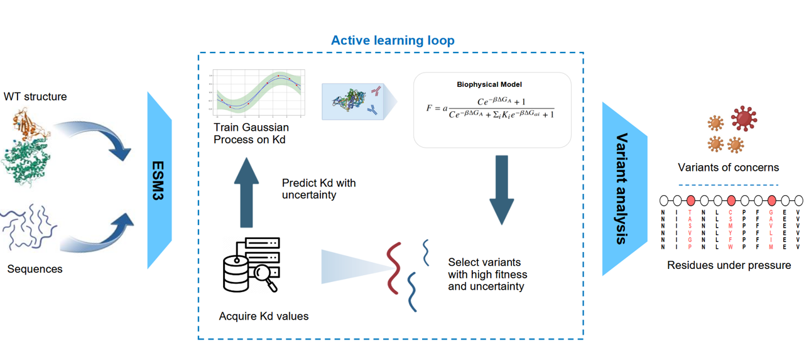

# Overview of VIRAL

Machine-learning workflow that **identifies high-fitness viral protein variants with up to 5× fewer wet-lab measurements**.  
The code base couples Bayesian active learning, Gaussian-process surrogate models and a biophysical fitness formulation. 

Data: https://doi.org/10.5281/zenodo.15511858 
- Download data_bloom and data_desai folders to get ESM embeddings and Kd values.
- Download script_results folder to get the variants selected by the model.
- Put these folders in the root directory.





## Repository layout

| Path                        | Purpose                                                                                                                                                                                                |
|-----------------------------|--------------------------------------------------------------------------------------------------------------------------------------------------------------------------------------------------------|
| **src/active_learner.py**   | Core `ActiveLearner` class: keeps global–index bookkeeping, implements acquisition strategies (`random`, `greedy`, `UCB`), logs metrics, and exposes helpers to retrieve training-set histories. |
| **src/gaussian_process.py** | Lightweight GPyTorch wrapper that builds a squared-exponential ARD kernel, trains hyper-parameters, and returns mean / variance predictions for embedding vectors.                                     |
| **src/bio_model.py**        | Biophysical fitness layer. Provides `default_fitness`, its gradient, and `bio_model_var` for variance propagation from GP output to fitness space.                                                     |
| **src/utils.py**            | Utility collection: data loading/clean-up.                          |


---

## How to cite

If you use this toolkit in published work, please cite:

```bibtex
@article{
doi:10.1073/pnas.2503742122,
author = {Marian Huot  and Dianzhuo Wang  and Jiacheng Liu  and Eugene I. Shakhnovich },
title = {Predicting high-fitness viral protein variants with Bayesian active learning and biophysics},
journal = {Proceedings of the National Academy of Sciences},
volume = {122},
number = {24},
pages = {e2503742122},
year = {2025},
doi = {10.1073/pnas.2503742122},
URL = {https://www.pnas.org/doi/abs/10.1073/pnas.2503742122},
eprint = {https://www.pnas.org/doi/pdf/10.1073/pnas.2503742122},
}
```
